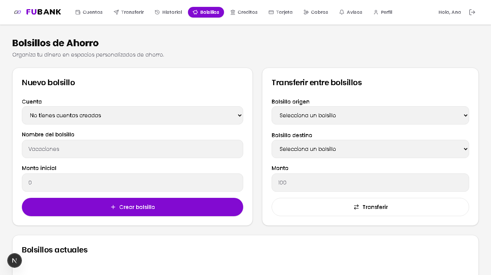
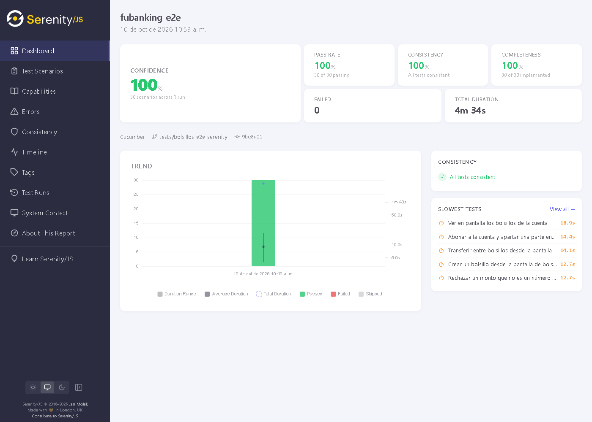
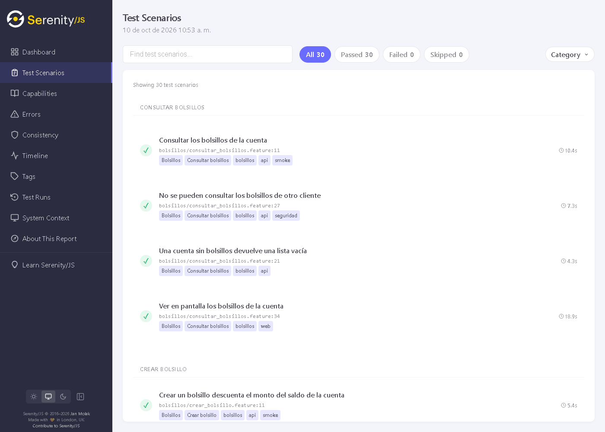
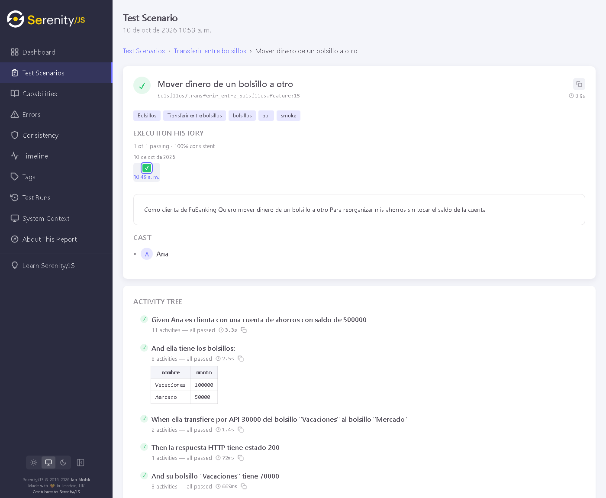
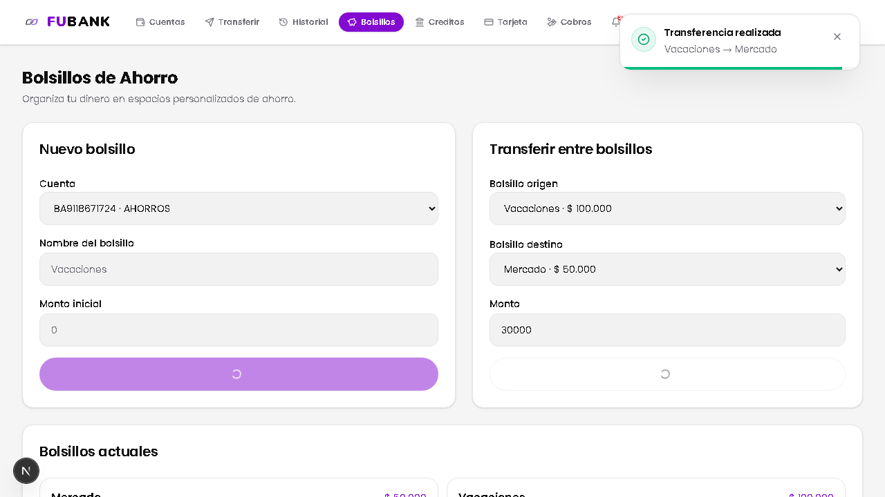
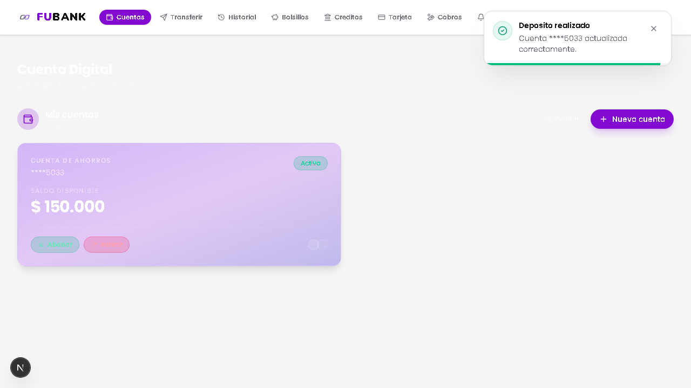
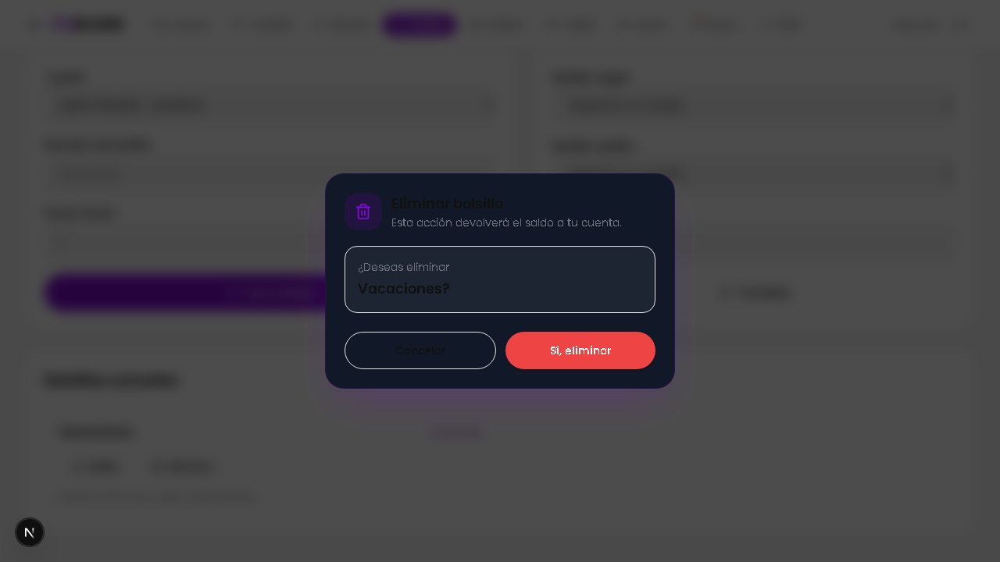
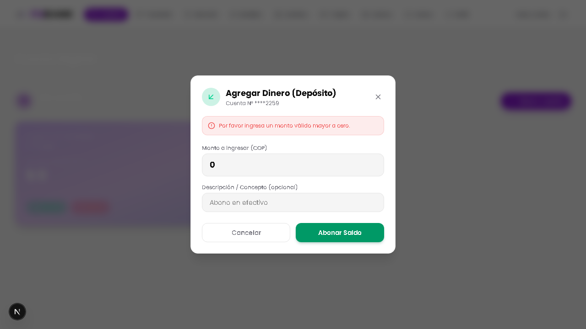

# Pruebas End-to-End (E2E) — Módulo **Bolsillos** y **Depósito** (FuBanking)

> **Asignatura:** Validación y Verificación de Software
> **Proyecto:** FuBanking — Banco digital
> **Alcance:** Bolsillos (crear, consultar, editar, eliminar, transferir) + Depositar dinero
> **Tipo de prueba:** Aceptación extremo a extremo (caja negra) con BDD y patrón Screenplay
> **Herramientas:** Serenity/JS 3.48 · Cucumber 13.3 · Playwright 1.63 (Chromium) · TypeScript 5.9
> **Rama:** `tests/bolsillos-e2e-serenity` (desde `dev`)
> **Fecha:** 2026-10-10

---

## 1. Resumen ejecutivo

Se construyó una suite de **36 escenarios de aceptación** que ejercitan FuBanking **en ejecución**:
el backend Express real contra Supabase y el frontend Next.js real en un navegador Chromium. Es la
primera suite del módulo en la que nada se simula: las pruebas unitarias, de regresión, de
seguridad y de performance usan repositorios en memoria o componentes aislados.

La suite sigue el ejemplo del curso (`serenityjs-e2e-testing`): Gherkin para describir el
comportamiento, el patrón **Screenplay** para automatizarlo y el reporte de Serenity/JS como
documentación viva. Cubre las seis funcionalidades en dos niveles: **27 escenarios de API** y
**9 de interfaz web**, uno de ellos un recorrido completo que cruza Cuentas y Bolsillos.

| Indicador | Valor |
|---|---:|
| Escenarios (incluye ejemplos de *Scenario Outline*) | **36** |
| Escenarios de API (`@api`) / web (`@web`) | **27 / 9** |
| Escenarios de seguridad (`@seguridad`: autorización y *type juggling*) | **7** |
| Escenarios de humo (`@smoke`) | **10** |
| Resultado sobre `dev` | **36 / 36 aprobados** |
| Mutaciones introducidas a propósito y detectadas | **5 / 5** |
| Defectos encontrados | **1** (E2E-01, corregido en `dev`; la suite queda como regresión) |
| Cambios de comportamiento en producción | **Ninguno** (solo atributos `id`/`data-testid`) |

**Hallazgo principal.** La suite detectó que un cliente que inicia sesión **sin marcar
"Recordarme"** (la opción por defecto) no podía ver sus cuentas ni sus bolsillos: el token quedaba
en `sessionStorage` y el cliente HTTP del frontend solo lo buscaba en `localStorage`, así que todas
las peticiones salían sin `Authorization`. Al integrar la rama con `dev` el defecto ya estaba
corregido por otro integrante; los 9 escenarios web lo vigilan desde ahora (sección 10.1).

---

## 2. Objetivo y alcance

### 2.1 Objetivo

Verificar que las seis funcionalidades **cumplen su propósito desde el punto de vista del
cliente**, atravesando todas las capas: navegador → Next.js → API REST → casos de uso → Supabase. En
particular, comprobar que:

1. Cada operación produce el efecto observable correcto **en pantalla** y **en el saldo real** de la
   cuenta (invariante de dinero: lo apartado sale del saldo y vuelve al eliminar).
2. Las reglas de negocio y las validaciones responden con el código HTTP y el código de error del
   contrato.
3. Ningún cliente puede leer ni modificar la cuenta o los bolsillos de otro.
4. La interfaz guía al usuario ante datos inválidos sin llegar al servidor.

### 2.2 Funcionalidades, endpoints y pantallas

| # | Funcionalidad | Endpoint | Pantalla | Archivo `.feature` |
|---|---|---|---|---|
| 1 | Crear bolsillo | `POST /api/v1/pockets` | `/pockets` → *Nuevo bolsillo* | `bolsillos/crear_bolsillo.feature` |
| 2 | Consultar bolsillos | `GET /api/v1/pockets/account/:accountId` | `/pockets` → *Bolsillos actuales* | `bolsillos/consultar_bolsillos.feature` |
| 3 | Editar bolsillo | `PATCH /api/v1/pockets/:pocketId` | `/pockets` → *Editar* | `bolsillos/editar_bolsillo.feature` |
| 4 | Eliminar bolsillo | `DELETE /api/v1/pockets/:pocketId` | `/pockets` → *Eliminar* + confirmación | `bolsillos/eliminar_bolsillo.feature` |
| 5 | Transferir entre bolsillos | `POST /api/v1/pockets/transfer` | `/pockets` → *Transferir entre bolsillos* | `bolsillos/transferir_entre_bolsillos.feature` |
| 6 | Depositar dinero | `POST /api/v1/accounts/:id/deposit` | `/accounts` → *Abonar* | `deposito/depositar.feature` |
| — | Recorrido completo | 6 + 1 | `/accounts` → `/pockets` | `recorrido/abonar_y_ahorrar.feature` |

Como apoyo (no son objeto de prueba) la suite usa `POST /auth/register`, `POST /accounts`,
`GET /accounts/:id` y el formulario de `/login`.

### 2.3 Fuera de alcance

- **Inicio de sesión con 2FA.** El segundo factor llega por correo; los clientes de prueba se crean
  sin 2FA. El *bypass* de 2FA ya está cubierto por la suite de seguridad (SEC-01).
- **Retiros y transferencias entre cuentas.** Son de otros integrantes del equipo.
- **Varios navegadores y dispositivos.** Solo Chromium de escritorio (1280 × 720).
- **Rendimiento bajo carga.** Lo cubre la suite de performance; aquí los tiempos solo son informativos.

---

## 3. Lugar de las E2E en la estrategia de pruebas

| Suite | Cantidad | Qué es real | Qué se simula | Pregunta que responde |
|---|---:|---|---|---|
| Unitarias (Chai BDD) | 70 | Casos de uso | Repositorios (5 dobles) | ¿La regla de negocio es correcta? |
| Regresión (supertest) | 94 | JWT, validadores, controladores, casos de uso | Persistencia (en memoria) | ¿Lo que funcionaba sigue funcionando? |
| Seguridad | 158 | Igual que regresión + `createApp()` | Persistencia | ¿Se puede abusar de la API? |
| Performance | 8 | HTTP sobre la app | Persistencia | ¿Responde dentro del presupuesto? |
| **E2E (este documento)** | **36** | **Todo: navegador, Next.js, API, Supabase** | **Nada** | **¿El cliente logra su objetivo?** |

```
                 ▲  menos pruebas, más lentas, más realistas
        E2E      │   36  · navegador + API + BD reales
     Seguridad   │  158  ┐
     Regresión   │   94  ├ API real, persistencia en memoria
   Performance   │    8  ┘
     Unitarias   │   70  · casos de uso aislados
                 ▼  más pruebas, más rápidas, más aisladas
```

Las E2E **no reemplazan** a las demás: son pocas y lentas a propósito. Su valor está en lo que las
otras no pueden ver: la integración del frontend con la API (el defecto E2E-01 era invisible para
las 330 pruebas anteriores), la persistencia real y la experiencia del usuario.

---

## 4. Marco de trabajo

### 4.1 Modelo del curso

Se tomó como referencia el proyecto del curso
[`serenityjs-e2e-testing`](https://github.com/mauricioramirezv/serenityjs-e2e-testing), con las
**mismas versiones** de dependencias y la misma organización:

| Ejemplo del curso | Equivalente en FuBanking |
|---|---|
| App de demostración local (`demoServer.ts`) | FuBanking real: backend `:3001` + frontend `:3000` + Supabase |
| `features/*.feature` (autenticación, catálogo, API) | `features/{bolsillos,deposito,recorrido}/` — una carpeta por capacidad |
| Actor con `CallAnApi` y `BrowseTheWebWithPlaywright` | Igual, más `TakeNotes` para recordar cuenta y bolsillos |
| `test/tasks` (`Authenticate`, `GetProducts`…) | `test/tasks/api` y `test/tasks/web` (`BecomeClient`, `PocketsApi`, `PocketsScreen`…) |
| `test/questions/ShopQuestions` | `ApiQuestions` y `ScreenQuestions` |
| `test/ui` (Lean Page Objects) | `LoginForm`, `PocketsPage`, `AccountsPage`, `Notifications` |
| Parámetros `{actor}` y `{pronoun}` | Igual (`Ana… ella`, `Carlos… él`) |
| Etiquetas `@web`, `@api`, `@smoke` | Igual, más `@bolsillos`, `@deposito` y `@seguridad` |
| `@serenity-js/html-reporter` | Igual, con capturas del `Photographer` |
| Contraseña enmascarada (`Masked`) | Igual, y además el token y la contraseña fuera del reporte (6.3) |
| Ejercicio 4: *blended testing* | Datos preparados por API y verificados en pantalla (y al revés) |

### 4.2 Patrón Screenplay

Screenplay describe la prueba como lo que **hace un actor** para cumplir un objetivo, no como una
secuencia de clics. Separa *qué* se quiere (tareas del dominio) de *cómo* se logra (interacciones
con una herramienta).

| Concepto | Qué es | En esta suite |
|---|---|---|
| **Actor** | Quien usa el sistema | Ana, Bruno, Carlos, Diana: clientes de FuBanking |
| **Ability** | Lo que el actor puede usar | `CallAnApi` (REST), `BrowseTheWebWithPlaywright` (navegador), `TakeNotes` (memoria) |
| **Interaction** | Acción atómica con una herramienta | `Send.a(PostRequest…)`, `Click.on(…)`, `Enter.theValue(…)` |
| **Task** | Objetivo de negocio formado por interacciones | `BecomeClient.withSavingsBalance(500000)`, `PocketsScreen.transfer(…)` |
| **Question** | Información que el actor consulta | `ApiQuestions.accountBalance()`, `ScreenQuestions.pocketAmount('Viaje')` |
| **Notepad** | Memoria del actor durante el escenario | `accountId`, correo y `nombre → id` de cada bolsillo |

Ejemplo de tarea (`test/tasks/api/PocketsApi.ts`): el paso Gherkin no conoce URLs ni cuerpos JSON.

```ts
transfer: (amount: number, from: string, to: string) =>
  Task.where(`#actor transfiere por API ${ amount } del bolsillo "${ from }" al bolsillo "${ to }"`,
    Send.a(PostRequest.to('pockets/transfer').with(
      Question.fromObject({ fromPocketId: PocketId.of(from), toPocketId: PocketId.of(to), amount }),
    )),
  ),
```

`PocketId.of('Vacaciones')` es una *Question* que resuelve el id que el actor anotó al crear el
bolsillo: el escenario habla de nombres y la tarea traduce a identificadores.

### 4.3 BDD con Gherkin

Los escenarios usan las palabras clave en inglés (como el ejemplo del curso) y el texto en español:

```gherkin
@bolsillos
Feature: Transferir entre bolsillos
  Background:
    Given Ana es clienta con una cuenta de ahorros con saldo de 500000
    And ella tiene los bolsillos:
      | nombre     | monto  |
      | Vacaciones | 100000 |
      | Mercado    | 50000  |

  @api @smoke
  Scenario: Mover dinero de un bolsillo a otro
    When ella transfiere por API 30000 del bolsillo "Vacaciones" al bolsillo "Mercado"
    Then la respuesta HTTP tiene estado 200
    And su bolsillo "Vacaciones" tiene 70000
    And su bolsillo "Mercado" tiene 80000
    And el saldo de su cuenta es 350000
```

- `{actor}` convierte un nombre propio en un actor (`actorCalled('Ana')`) y lo pone en foco.
- `{pronoun}` (`él`/`ella`) devuelve el actor en foco, para escribir en lenguaje natural.
- Los *step definitions* (`features/step-definitions/`) **no tienen selectores ni URLs**: solo
  delegan en tareas y preguntas.

### 4.4 Lean Page Objects

Los selectores viven en `test/ui/` como funciones que devuelven `PageElement` con una descripción
legible, que es la que aparece en el reporte:

```ts
pocketCard: (name: string) =>
  PageElements.located(byTestId('pocket-card'))
    .where(Text.of(PageElement.located(byTestId('pocket-card-name'))), equals(name))
    .first()
    .describedAs(`tarjeta del bolsillo "${ name }"`),
```

La tarjeta se localiza **por su contenido** (el nombre del bolsillo), no por su posición en la
lista; si el orden cambia, la prueba sigue siendo válida.

---

## 5. Arquitectura de la suite

### 5.1 Vista de componentes

```
 features/*.feature (Gherkin)
          │  Cucumber 13 + @serenity-js/cucumber
          ▼
 step-definitions ──► Tasks / Questions (Screenplay) ──► Lean Page Objects (test/ui)
                              │
             ┌────────────────┼──────────────────────────────┐
             ▼                ▼                              ▼
        CallAnApi        TakeNotes            BrowseTheWebWithPlaywright
     (axios + JWT)   (accountId, bolsillos)    (Chromium, contexto aislado)
             │                                               │
             ▼                                               ▼
   API Express :3001/api/v1  ◄─────── HTTP + JWT ───────  Next.js :3000
             │
             ▼
         Supabase (usuarios, cuentas; bolsillos en memoria si falta la tabla)

 Reporte: @serenity-js/console-reporter + @serenity-js/html-reporter + Photographer
```

### 5.2 Estructura de carpetas

```
e2e/
  package.json  cucumber.yaml  tsconfig.json  README.md  scripts/clean.js
  features/
    bolsillos/   crear · consultar · editar · eliminar · transferir (.feature)
    deposito/    depositar.feature
    recorrido/   abonar_y_ahorrar.feature
    step-definitions/  parameter · cliente · bolsillos · deposito (.steps.ts)
    support/serenity.config.ts
  test/
    tasks/api/   BecomeClient · DepositMoney · ConsultAccount · PocketsApi
    tasks/web/   SignIn · PocketsScreen · AccountsScreen
    questions/   ApiQuestions · ScreenQuestions
    ui/          LoginForm · PocketsPage · AccountsPage · Notifications · selectors
    support/     environment · testData · ClientNotes · Credentials · apiTypes
```

### 5.3 Configuración

| Elemento | Valor | Motivo |
|---|---|---|
| Elenco (`Cast`) | Cada actor recibe `CallAnApi`, `TakeNotes` y, si hay navegador, `BrowseTheWebWithPlaywright` | Un mismo actor puede preparar datos por API y verificarlos en pantalla |
| Contexto del navegador | Uno por actor y por escenario, `locale: 'es-CO'` | Sesiones aisladas; formato de moneda colombiano |
| *Timeout* de la API | 30 s por petición (`CallAnApi.using`) | Absorber la latencia de Supabase al preparar datos (sección 9) |
| Espera de navegación | `networkidle`, 60 s | Esperar a que Next.js hidrate la página (sección 9) |
| Tiempo por interacción | 15 s (`interactionTimeout`) | Compilación de rutas en modo `next dev` |
| Tiempo por paso Cucumber | 90 s | Primer acceso a cada ruta en desarrollo |
| `BeforeAll` | Verifica `GET /health` y `GET /login` | Falla en segundos con un mensaje claro si el sistema no está arriba |
| Equipo de reporte | Consola + HTML + `Photographer` (fallos, o todas las interacciones con `E2E_PHOTOS=all`) | Evidencia navegable |

Variables de entorno: `E2E_API_URL`, `E2E_WEB_URL`, `HEADLESS=false`, `SERENITY_API_ONLY=true`
(no abre navegador) y `E2E_PHOTOS=all`.

### 5.4 Ciclo de vida de un escenario

1. `BeforeAll`: comprueba que backend y frontend respondan, abre Chromium y configura el elenco.
2. `Background`: el actor se registra por API, abre una cuenta de ahorros y deposita el saldo inicial.
3. Pasos `Given`: datos adicionales por API (bolsillos) y, en escenarios web, inicio de sesión por el
   formulario.
4. Pasos `When`: la acción bajo prueba, por API o por pantalla.
5. Pasos `Then`: verificación del contrato HTTP, de la pantalla y del **estado real** del backend.
6. Al terminar, Serenity/JS descarta los actores y cierra sus contextos de navegador; el reporte
   recibe cada paso, cada petición HTTP y las capturas.

---

## 6. Estrategia de datos de prueba

### 6.1 Autoaprovisionamiento por escenario

Cada escenario **crea su propio cliente** desde cero (`BecomeClient`):

| Paso | Petición | Resultado anotado |
|---|---|---|
| Registro sin 2FA | `POST /auth/register` | Token de sesión (fuera del Notepad) |
| Cuenta de ahorros | `POST /accounts` `{ type: 'AHORROS' }` | `accountId` |
| Saldo inicial (si > 0) | `POST /accounts/:id/deposit` | — |

Los datos son únicos por corrida (`e2e.<marca-de-tiempo><aleatorio>@fubanking.test`, documento
`E2E…`, contraseña aleatoria que cumple la política). Ventajas:

- **Independencia y repetibilidad (FIRST).** Ningún escenario depende de otro, del orden de ejecución
  ni de datos sembrados a mano; se puede ejecutar uno solo o todos.
- **Saldos conocidos.** Cada aserción sobre dinero parte de un valor exacto.
- **Sin colisiones** entre ejecuciones ni entre integrantes que corran la suite en paralelo.

El costo es que cada corrida deja ≈ 40 usuarios de prueba en Supabase, identificables por el
dominio reservado `.test` y el prefijo `e2e.` (sección 14).

### 6.2 Memoria del actor y referencias por nombre

El `Notepad` guarda `email`, `accountId` y un mapa `nombre → id` de los bolsillos que el actor creó.
Las tareas lo actualizan al renombrar o eliminar, y solo cuando la respuesta fue exitosa. Así los
escenarios se escriben en el lenguaje del cliente ("el bolsillo *Vacaciones*") y no con UUID.

### 6.3 Credenciales fuera del reporte

El reporte de Serenity/JS imprime el contenido del Notepad y adjunta el cuerpo de cada petición
`Send`. En una primera versión la contraseña y el JWT quedaban visibles en la evidencia. Se corrigió
con tres medidas:

1. La contraseña y el token se guardan en un almacén privado (`WeakMap` por actor,
   `test/support/Credentials.ts`), no en el Notepad.
2. El registro se envía con `CallAnApi.request()` dentro de una *Interaction*, no con `Send`, para
   que el cuerpo (contraseña) y la respuesta (token) no se adjunten al reporte.
3. La contraseña se escribe en el formulario con `Masked.valueOf(…)`: el reporte muestra
   `[a masked value]`.

### 6.4 Varios actores en un escenario

Las pruebas de autorización necesitan un segundo cliente (Bruno o Diana). Cada actor tiene su propia
sesión, su propio token y su propio Notepad. El helper `noteOf(dueño, nota, solicitante)` lee la
cuenta o el bolsillo del otro actor y **devuelve el foco** al que actúa, para que los pasos
siguientes ("la respuesta HTTP tiene estado 403") se evalúen sobre la petición correcta.

---

## 7. Diseño de casos de prueba

### 7.1 Técnicas aplicadas

| Técnica | Dónde |
|---|---|
| Partición de equivalencia | Montos válidos / cero / negativos / no numéricos; nombres válidos / vacíos |
| Valores límite | Bolsillo por el saldo exacto (500000) y por saldo + 1 (500001); transferir todo el bolsillo (100000) y 100001; ajustar a 500001 |
| Casos negativos con contrato de error | Código HTTP **y** código de error (`VALIDATION_ERROR`, `INSUFFICIENT_*`, `INVALID_*`, `FORBIDDEN`) |
| Verificación de efectos laterales | Después de cada operación (exitosa o rechazada) se consulta el saldo real de la cuenta |
| Autorización a nivel de objeto (BOLA/IDOR) | Consultar, eliminar y depositar sobre recursos de otro cliente |
| *Type juggling* | `true`, `"abc"`, `null` y `[1000]` como monto de depósito |
| *Blended testing* | Datos por API → verificación en pantalla, y acción en pantalla → verificación por API |
| Recorrido de usuario | Abonar en Cuentas y apartar en un bolsillo nuevo |

### 7.2 Catálogo de escenarios

**Crear bolsillo** (`crear_bolsillo.feature`, saldo inicial 500000)

| ID | Escenario | Nivel | Técnica | Resultado esperado |
|---|---|---|---|---|
| E2E-CR-01 | Crear un bolsillo descuenta el monto del saldo | API · smoke | Partición válida | 201 · saldo 400000 |
| E2E-CR-02 | Se puede apartar todo el saldo disponible | API | Valor límite | 201 · saldo 0 |
| E2E-CR-03 | Rechazar un bolsillo con nombre vacío | API | Partición inválida | 400 `VALIDATION_ERROR` · saldo intacto |
| E2E-CR-04 | Rechazar un bolsillo con monto negativo | API | Partición inválida | 400 `VALIDATION_ERROR` · saldo intacto |
| E2E-CR-05 | Rechazar un bolsillo con monto mayor al saldo | API | Valor límite (saldo + 1) | 400 `INSUFFICIENT_AVAILABLE_BALANCE` |
| E2E-CR-06 | Crear un bolsillo desde la pantalla | Web · smoke | Blended (verifica saldo por API) | Toast "Bolsillo creado" · tarjeta con 100000 · saldo 400000 |
| E2E-CR-07 | La pantalla pide el nombre antes de crear | Web | Validación en cliente | Toast "Falta información" · saldo intacto |

**Consultar bolsillos** (`consultar_bolsillos.feature`)

| ID | Escenario | Nivel | Técnica | Resultado esperado |
|---|---|---|---|---|
| E2E-CO-01 | Consultar los bolsillos de la cuenta | API · smoke | Partición válida | 200 · 2 bolsillos |
| E2E-CO-02 | Una cuenta sin bolsillos devuelve lista vacía | API | Caso borde | 200 · 0 bolsillos |
| E2E-CO-03 | No se pueden consultar los bolsillos de otro cliente | API · seguridad | BOLA | 403 `FORBIDDEN` |
| E2E-CO-04 | Ver en pantalla los bolsillos de la cuenta | Web | Blended (datos por API) | Nombres y montos correctos |

**Editar bolsillo** (`editar_bolsillo.feature`, bolsillo "Vacaciones" de 100000)

| ID | Escenario | Nivel | Técnica | Resultado esperado |
|---|---|---|---|---|
| E2E-ED-01 | Renombrar conserva el saldo | API · smoke | Partición válida | 200 · "Viaje a Cartagena" con 100000 |
| E2E-ED-02 | Aumentar el monto descuenta la diferencia | API | Efecto lateral | 200 · bolsillo 150000 · saldo 350000 |
| E2E-ED-03 | Disminuir el monto devuelve la diferencia | API | Efecto lateral | 200 · bolsillo 40000 · saldo 460000 |
| E2E-ED-04 | No se puede ajustar por encima del dinero total | API | Valor límite (500001) | 400 `INSUFFICIENT_AVAILABLE_BALANCE` · saldo 400000 |
| E2E-ED-05 | Renombrar desde la pantalla | Web | Flujo de UI | Toast "Bolsillo actualizado" · tarjeta renombrada |

**Eliminar bolsillo** (`eliminar_bolsillo.feature`, bolsillo "Vacaciones" de 100000)

| ID | Escenario | Nivel | Técnica | Resultado esperado |
|---|---|---|---|---|
| E2E-EL-01 | Eliminar devuelve el saldo a la cuenta | API · smoke | Invariante de dinero | 200 · saldo 500000 · sin bolsillos |
| E2E-EL-02 | No se puede eliminar el bolsillo de otro cliente | API · seguridad | BOLA | 403 `FORBIDDEN` · saldo del dueño intacto |
| E2E-EL-03 | Eliminar desde la pantalla con confirmación | Web · smoke | Flujo con modal | Toast "Bolsillo eliminado" · lista vacía · saldo 500000 |

**Transferir entre bolsillos** (`transferir_entre_bolsillos.feature`, "Vacaciones" 100000 y "Mercado" 50000)

| ID | Escenario | Nivel | Técnica | Resultado esperado |
|---|---|---|---|---|
| E2E-TR-01 | Mover dinero de un bolsillo a otro | API · smoke | Partición válida | 200 · 70000 / 80000 · saldo 350000 sin cambios |
| E2E-TR-02 | Transferir todo el saldo del bolsillo | API | Valor límite | 200 · 0 / 150000 |
| E2E-TR-03 | No transferir más de lo que tiene el origen | API | Valor límite (+1) | 400 `INSUFFICIENT_POCKET_BALANCE` · origen intacto |
| E2E-TR-04 | Origen y destino deben ser diferentes | API | Partición inválida | 400 `INVALID_TRANSFER_TARGET` |
| E2E-TR-05 | Transferir desde la pantalla | Web | Blended (bolsillos por API) | Toast "Transferencia realizada" · 70000 / 80000 |

**Depositar** (`depositar.feature`, cuenta con saldo 0)

| ID | Escenario | Nivel | Técnica | Resultado esperado |
|---|---|---|---|---|
| E2E-DE-01 | Depositar un monto válido con descripción | API · smoke | Partición válida | 200 · saldo 250000 |
| E2E-DE-02 | Los depósitos se acumulan | API | Secuencia | saldo 150000 |
| E2E-DE-03 | Rechazar depósito de 0 | API | Valor límite | 400 `INVALID_AMOUNT` · saldo 0 |
| E2E-DE-04 | Rechazar depósito negativo | API | Partición inválida | 400 `INVALID_AMOUNT` · saldo 0 |
| E2E-DE-05 | Monto `true` | API · seguridad | *Type juggling* | 400 `INVALID_AMOUNT` · saldo 0 |
| E2E-DE-06 | Monto `"abc"` | API · seguridad | *Type juggling* | 400 `INVALID_AMOUNT` · saldo 0 |
| E2E-DE-07 | Monto `null` | API · seguridad | *Type juggling* | 400 `INVALID_AMOUNT` · saldo 0 |
| E2E-DE-08 | Monto `[1000]` | API · seguridad | *Type juggling* | 400 `INVALID_AMOUNT` · saldo 0 |
| E2E-DE-09 | No depositar en la cuenta de otro cliente | API · seguridad | BOLA | 403 `FORBIDDEN` · saldo ajeno intacto |
| E2E-DE-10 | Abonar desde la pantalla de cuentas | Web · smoke | Blended (verifica por API) | Toast "Deposito realizado" · saldo 150000 en pantalla y en la API |
| E2E-DE-11 | El formulario rechaza un monto en cero | Web | Validación en cliente | Mensaje "Por favor ingresa un monto válido mayor a cero." · saldo 0 |

**Recorrido completo** (`abonar_y_ahorrar.feature`)

| ID | Escenario | Nivel | Resultado esperado |
|---|---|---|---|
| E2E-RC-01 | Abonar a la cuenta y apartar una parte en un bolsillo nuevo | Web · smoke | Saldo 200000 en pantalla → bolsillo "Emergencias" con 50000 → saldo real 150000 |

### 7.3 Trazabilidad

| Funcionalidad | API | Web | Seguridad | Relación con otras suites |
|---|:---:|:---:|:---:|---|
| Crear | 5 | 2 | — | Regresión RG-CR-*; D-02 corregido (SEC-03) |
| Consultar | 3 | 1 | 1 | SEC-AUTHZ (IDOR) |
| Editar | 4 | 1 | — | Regresión RG-AC-* |
| Eliminar | 2 | 1 | 1 | Regresión RG-EL-*; SEC-AUTHZ |
| Transferir | 4 | 1 | — | Regresión RG-TR-* |
| Depositar | 9 | 2 | 5 | D-08 / SEC-04 (*type juggling*), SEC-AUTHZ |
| Recorrido | — | 1 | — | Cruza Depositar y Crear |
| **Total** | **27** | **9** | **7** | |

Los escenarios de seguridad repiten, **contra el sistema real**, controles que la suite de seguridad
verificó con persistencia en memoria. Confirman que las correcciones de SEC-03/SEC-04 y los controles
de propiedad funcionan también con Supabase y sobre HTTP real.

---

## 8. Testabilidad: cambios en el frontend

Para tener selectores estables se agregaron **atributos sin efecto funcional** (commit
`test(frontend): selectores estables…`):

| Componente | Atributos | Uso |
|---|---|---|
| `PocketsClient.tsx` | `id`: `pocket-name`, `pocket-amount`, `transfer-amount`, `edit-pocket-name`, `edit-pocket-amount` | Campos de los formularios |
| `PocketsClient.tsx` | `data-testid`: `create-pocket-button`, `transfer-pockets-button`, `pocket-card`, `pocket-card-name`, `pocket-card-amount`, `edit-pocket-button`, `delete-pocket-button`, `save-pocket-button`, `confirm-delete-pocket-button`, `pockets-empty` | Botones, tarjetas y estado vacío |
| `AccountCard.tsx` | `data-testid`: `account-card`, `account-balance`, `deposit-button` | Tarjeta de la cuenta |
| `DepositWithdrawModal.tsx` | `id="dw-amount"` + `htmlFor`, `data-testid`: `dw-submit`, `dw-error` | Modal de abono |
| `ToastProvider.tsx` | `data-testid="toast-title"` | Notificaciones |

Criterio: `id` en los campos de formulario y `data-testid` en lo que no tiene semántica propia. Como
efecto secundario positivo, los `id` hacen que cada `<label htmlFor>` quede **asociado** a su campo
(antes el `htmlFor` apuntaba a `undefined`), lo que mejora la accesibilidad. Las 257
pruebas unitarias del frontend siguen en verde.

---

## 9. Sincronización: problemas encontrados y cómo se resolvieron

Una E2E confiable no puede depender de `sleep`. Durante la construcción aparecieron cinco fuentes de
inestabilidad; todas se resolvieron con esperas por condición o con márgenes explícitos:

| Síntoma | Causa | Solución |
|---|---|---|
| El primer login de la corrida no llegaba a `/profile` | El clic ocurría antes de que React hidratara la página: el formulario se enviaba de forma nativa | Navegación con `waitUntil: 'networkidle'` |
| `Wait.until(tarjeta, isVisible())` agotaba el tiempo | En Serenity/JS `isVisible` exige que el elemento esté **dentro del viewport**, y la lista de bolsillos queda bajo los formularios | `isPresent()` para esperar; `Click` hace *scroll* automáticamente |
| "Crear bolsillo" mostraba "Falta información" | La cuenta del selector se carga de forma asíncrona | `Wait.until(Value.of(selector de cuenta), not(equals('')))` |
| La lista llegaba como `[Mercado, Vacaciones]` | El orden lo decide el backend (más reciente primero) | Comparar los nombres **ordenados**: el escenario verifica *qué* bolsillos hay, no su orden |
| Un escenario quedó *comprometido* al preparar datos (`POST /accounts` > 10 s) | Latencia ocasional de Supabase frente al *timeout* por defecto de `CallAnApi` (10 s) | `CallAnApi.using({ baseURL, timeout: 30_000 })` |

Además, las verificaciones en pantalla usan `Ensure.eventually` (reintenta hasta 15 s), porque las
notificaciones y los saldos se actualizan después de la respuesta HTTP.

---

## 10. Hallazgos

### 10.1 E2E-01 — Sin "Recordarme" la aplicación no envía el token

| Campo | Detalle |
|---|---|
| Severidad | **Alta**: bloquea las funcionalidades para el inicio de sesión por defecto |
| Componente | `frontend/src/shared/services/api.client.ts` + `frontend/src/shared/hooks/useAuth.tsx` |
| Detectado por | Los 9 escenarios `@web` (primera ejecución) |
| Estado | **Corregido en `dev`** (commit `365171d`); la suite queda como regresión |

**Comportamiento observado.** Tras iniciar sesión sin marcar "Recordarme", la pantalla de bolsillos
mostraba "No tienes cuentas creadas" y la de cuentas no mostraba ninguna tarjeta, aunque el cliente sí
tenía cuenta y saldo (verificado por API en el mismo escenario).

**Causa raíz.** El inicio de sesión guarda el token según la casilla, pero el cliente HTTP solo lo
leía de un lugar:

```ts
// useAuth.tsx — login()
if (rememberMe) localStorage.setItem('token', newToken);
else            sessionStorage.setItem('token', newToken);   // opción por defecto

// api.client.ts — interceptor (versión con el defecto)
const token = localStorage.getItem('token');                  // nunca mira sessionStorage
if (token) config.headers.Authorization = `Bearer ${token}`;
```

Sin `Authorization`, el backend responde 401 a `GET /accounts/me` y a `GET /pockets/account/:id`.
La navegación sí funcionaba porque `middleware.ts` revisa la *cookie* `token`, que se escribe en
ambos casos: por eso el defecto parecía un problema de datos y no de sesión.

**Por qué no lo vieron las otras suites.** Las pruebas de API envían el token directamente y las
pruebas de componentes simulan el servicio. Solo una prueba que inicia sesión en un navegador real y
luego usa la aplicación puede observar la integración entre `useAuth` y `api.client`.

**Evidencia.** Con el defecto, 9 de 9 escenarios web fallaban esperando la cuenta del cliente (el
inicio de sesión sí llegaba a `/profile`). Marcando "Recordarme" como contramedida temporal, y una vez
resuelta la sincronización de la sección 9, los 9 pasaban: la única variable era dónde quedaba el
token (`02-defecto-E2E-01.txt`). Sobre `dev`, sin la contramedida, pasan los 9.



**Corrección (en `dev`).** `getAuthToken()` busca el token en `localStorage`, luego en
`sessionStorage` y por último en la cookie. Al integrar la rama se retiró la contramedida: la tarea
`SignIn` ya **no** marca "Recordarme", como un usuario real, y así los 9 escenarios web vigilan que el
defecto no reaparezca. La mutación M1 (sección 12) lo comprueba: al volver a leer solo
`localStorage`, la suite falla.

### 10.2 Relación con defectos conocidos

| Defecto | Estado según la regresión | Observación E2E |
|---|---|---|
| D-02 / SEC-03 — `true` como monto al crear | Corregido | El contrato de validación se verifica con montos negativos y vacíos (E2E-CR-03/04) |
| D-08 / SEC-04 — `true` como monto al depositar | Corregido | Confirmado **contra el sistema real**: `true`, `"abc"`, `null` y `[1000]` → 400 sin mover el saldo (E2E-DE-05 a 08) |
| D-05 — Lo apartado se cuenta dos veces al crear | Abierto (`it.fails` RG-CR-D05) | Los datos de la suite no lo disparan (100000 + 50000 sobre 500000). Se deja en la suite de regresión para no tener una E2E en rojo permanente |
| D-01/D-03, D-04 | Abiertos | Fuera de los datos de esta suite |

### 10.3 Observaciones

- **Tabla `pockets`.** Si no existe en Supabase, el backend guarda los bolsillos en memoria. La
  suite no se ve afectada (cada escenario crea los suyos), pero un reinicio del backend a mitad de
  corrida haría fallar los escenarios en curso.
- **Mensajes de toast sin tilde** ("Deposito realizado"). Se verifican tal como están; corregirlos
  exige actualizar el escenario E2E-DE-10.

---

## 11. Resultados

### 11.1 Ejecución completa sobre `dev`

Ejecución del 2026-10-10 sobre `dev` (`38e398e` + esta rama), backend y frontend en modo desarrollo,
Chromium sin interfaz y captura de **cada** interacción (`E2E_PHOTOS=all`):

| Feature | Ejecuciones | Aprobadas | Duración |
|---|---:|---:|---:|
| Crear bolsillo | 7 | 7 | 46,1 s |
| Consultar bolsillos | 4 | 4 | 40,8 s |
| Editar bolsillo | 5 | 5 | 40,3 s |
| Eliminar bolsillo | 3 | 3 | 30,1 s |
| Transferir entre bolsillos | 5 | 5 | 45,4 s |
| Depositar dinero en la cuenta | 11 | 11 | 57,2 s |
| Recorrido completo de ahorro | 1 | 1 | 14,4 s |
| **Total** | **36** | **36** | **4 min 34 s** |

- **Por nivel:** 27/27 de API y 9/9 web. Sin capturas de cada paso la suite completa tarda ≈ 3,5 min;
  solo API (`npm run test:api`), ≈ 2 min.
- **Corrida final.** Tras el análisis de sensibilidad y el ajuste del *timeout* de la API (sección 9),
  la suite se ejecutó de nuevo con la configuración definitiva: **36/36 aprobados en 3 min 20 s** (`04-ejecucion-final.txt`).
- **36 ejecuciones y 30 escenarios.** Cucumber cuenta cada fila de un *Scenario Outline* como una
  ejecución; el reporte HTML las agrupa en un solo escenario (3 + 2 + 4 filas → 3 escenarios). Por eso
  el panel del reporte muestra 30.
- El escenario más lento es el web de consulta (≈ 19 s): registra al cliente, crea dos bolsillos por
  API, inicia sesión y carga la pantalla.

### 11.2 Otras verificaciones tras integrar con `dev`

| Verificación | Resultado |
|---|---|
| `tsc --noEmit` de la suite E2E | 0 errores |
| Cucumber `--dry-run` (pasos sin definir o ambiguos) | 0 |
| Pruebas unitarias del frontend con los atributos nuevos | 257 ✅ (37 archivos) |

### 11.3 Reporte de Serenity/JS

El reporte (`e2e/reports/serenity-js/index.html`, servido con `npm run test:report`) es la
**documentación viva** de la suite: organiza los escenarios por capacidad (carpeta) y *feature*, y
para cada uno muestra la narrativa, el elenco, el árbol de tareas e interacciones, las peticiones
HTTP y las capturas.







### 11.4 Capturas de la aplicación durante las pruebas

Capturas tomadas por el `Photographer` de Serenity/JS durante la ejecución (Chromium sin interfaz,
1280 × 720). Los clientes, cuentas y montos son los que cada escenario creó para sí mismo.









---

## 12. Sensibilidad: la suite detecta cambios que rompen el comportamiento

Una suite que siempre pasa no demuestra nada. Se introdujeron cambios a propósito en el código de
producción, uno a la vez; se ejecutó la parte afectada de la suite y se revirtió el cambio:

| ID | Cambio introducido (y revertido) | Capa | Escenarios ejecutados | Resultado |
|---|---|---|---|---|
| M1 | `api.client.ts`: `getAuthToken()` solo lee `localStorage` (**reintroduce E2E-01**) | Frontend | `@web` (9) | **9 de 9 fallan** esperando la cuenta del cliente: la API responde 401 (figura 8)¹ |
| M2 | `DeletePocket`: **resta** el monto del bolsillo al saldo en vez de sumarlo | Backend | Eliminar (3) | **2 fallan** (E2E-EL-01 y EL-03): saldo 300000 en vez de 500000 |
| M3 | `DepositMoney`: sin `account.assertBelongsTo(userId)` | Backend | `@deposito and @api` (9) | **1 falla** (E2E-DE-09): HTTP 200 en vez de 403 — Carlos deposita en la cuenta de Diana |
| M4 | `DepositWithdrawModal`: sin la validación `monto <= 0` en el cliente | Frontend | `@deposito and @web` (3) | **1 falla** (E2E-DE-11): aparece el mensaje del backend en lugar del de validación |
| M5 | `handleTransfer`: no recarga los bolsillos después de transferir | Frontend | Transferir en pantalla (1) | **1 falla** (E2E-TR-05): "Vacaciones" sigue mostrando 100000 en vez de 70000 |

¹ En la corrida de M1, 8 escenarios fallaron en la aserción esperada y el de transferencia en pantalla
quedó *comprometido* antes de llegar al código mutado (`POST /accounts` superó el *timeout* de 10 s
al preparar datos). Se repitió aislado con la mutación aplicada y falló en la misma aserción que los
otros 8. A raíz de esto se subió el *timeout* de la API a 30 s (sección 9).

Lectura de los resultados:

- **Cada mutación rompió exactamente los escenarios que debía.** Con M2 el escenario de bolsillo ajeno
  (E2E-EL-02) siguió en verde porque no toca el saldo del dueño; con M3 los otros 8 escenarios de
  depósito siguieron en verde porque nadie más deposita en una cuenta ajena; con M4 el abono válido y
  el recorrido siguieron en verde. Es la evidencia de que cada escenario verifica **una** regla y no
  falla por accidente.
- **M4 y M5 solo pueden detectarse con una E2E.** M4 deja el sistema "correcto" (el backend también
  rechaza el 0), pero cambia lo que ve el usuario; M5 deja la API correcta y la pantalla
  desactualizada. Ninguna prueba de API o de caso de uso puede observar esas diferencias.
- **Restauración.** Tras revertir las cinco mutaciones (`git status` limpio en `backend/` y
  `frontend/`), `npm run test:smoke` volvió a **10 / 10 aprobados**.

---

## 13. Evidencia (`docs/evidencia-e2e-bolsillos/`)

| Archivo | Contenido |
|---|---|
| `01-suite-completa-sobre-dev.txt` | Salida de consola de la ejecución completa sobre `dev` (36/36): cada paso, tarea e interacción con su duración |
| `02-defecto-E2E-01.txt` | Detección (9/9 web fallan), contramedida temporal (9/9 pasan), causa raíz y corrección |
| `03-sensibilidad-mutaciones.txt` | Las mutaciones de la sección 12: *diff*, comando, resultado, pasos que fallaron y restauración |
| `04-ejecucion-final.txt` | Corrida completa con la configuración definitiva (*timeout* de API de 30 s), sin capturas por paso |
| `10-` a `13-*.png` | Capturas de la aplicación durante las pruebas (figuras 4 a 7) |
| `14-e2e-01-reintroducido.png` | Pantalla de bolsillos con el defecto E2E-01 reintroducido (figura 8) |
| `20-` a `22-*.png` | Vistas del reporte de Serenity/JS (figuras 1 a 3) |

El reporte HTML completo no se versiona: se regenera en cada corrida en `e2e/reports/serenity-js/`
(ignorado por git).

---

## 14. Limitaciones y riesgos residuales

| Limitación | Impacto | Mitigación / siguiente paso |
|---|---|---|
| Requiere backend, frontend y Supabase levantados | No corre en un entorno sin red | `BeforeAll` falla rápido con un mensaje claro; en CI usar `docker compose` |
| Latencia de Supabase (servicio remoto compartido) | Un escenario puede quedar *comprometido* al preparar datos | *Timeout* de 30 s; Serenity/JS distingue "comprometido" (falla del entorno) de "fallido" (falla del sistema) |
| Cada corrida deja ≈ 40 usuarios `e2e.*@fubanking.test` | Crecimiento de la tabla `users` | Script de limpieza por dominio `.test` con `service_role` (fuera del frontend) |
| Tiempos en modo `next dev` | Primera visita a cada ruta compila la página | Ejecutar contra `next build && next start` en CI |
| Solo Chromium de escritorio | No detecta problemas de otros motores o móviles | Agregar proyectos de Playwright (Firefox, WebKit, viewport móvil) |
| 2FA no automatizado | El flujo con segundo factor no se prueba de punta a punta | Buzón de prueba o endpoint de pruebas para leer el OTP |
| Node 24.14 frente a `^24.15.0` que piden las dependencias | Aviso `EBADENGINE` al instalar | Actualizar Node a 24.15+ |

---

## 15. Integración continua

La suite **no se agregó al `Jenkinsfile`** en esta entrega: necesita la aplicación desplegada y una
base de datos, y el pipeline actual construye imágenes y corre pruebas sin infraestructura. La
propuesta es una etapa posterior al *smoke test* con Docker:

```groovy
stage('E2E: Bolsillos y Depósito') {
  steps {
    dir('e2e') {
      sh 'npm ci && npx playwright install --with-deps chromium'
      sh 'E2E_API_URL=http://backend:3001/api/v1/ E2E_WEB_URL=http://frontend:3000 npm run test:smoke'
    }
  }
  post { always { archiveArtifacts artifacts: 'e2e/reports/serenity-js/**', allowEmptyArchive: true } }
}
```

Con `@smoke` (10 escenarios: 6 de API y 4 web) el costo en el pipeline es de uno a dos minutos; la
suite completa puede ejecutarse de noche o antes de cada *merge* a `main`.

---

## 16. Cómo ejecutar

```bash
# 1. Levantar el sistema (cada uno en su terminal)
npm --prefix backend run dev        # http://localhost:3001
npm --prefix frontend run dev       # http://localhost:3000

# 2. Instalar la suite (una vez)
cd e2e
npm install
npx playwright install chromium

# 3. Ejecutar
npm test                            # 36 escenarios
npm run test:api                    # 27, sin navegador
npm run test:web                    # 9, con Chromium
npm run test:smoke                  # 10 de humo
npm test -- --tags @seguridad       # autorización y type juggling
npm run test:report                 # reporte en http://localhost:8080
```

Desde la raíz: `npm run test:e2e`. Para ver el navegador: `HEADLESS=false` (en PowerShell,
`$env:HEADLESS = "false"`).

---

## 17. Archivos entregados

| Archivo | Contenido |
|---|---|
| `e2e/features/**/*.feature` | 7 features, 36 escenarios |
| `e2e/features/step-definitions/*.steps.ts` | Enlace Gherkin → Screenplay |
| `e2e/features/support/serenity.config.ts` | Elenco, habilidades, tiempos y reporte |
| `e2e/test/tasks/{api,web}/*.ts` | Tareas de negocio |
| `e2e/test/questions/*.ts` | Preguntas sobre la API y la pantalla |
| `e2e/test/ui/*.ts` | Lean Page Objects |
| `e2e/test/support/*.ts` | Entorno, datos únicos, notas y credenciales |
| `e2e/README.md` | Guía rápida de la suite |
| `frontend/src/…` (4 componentes) | Atributos `id` / `data-testid` (sección 8) |
| `package.json` (raíz), `AGENTS.md` | Script `test:e2e` y mapa del repositorio |
| `docs/pruebas-e2e-bolsillos.{md,docx,pdf}` | Este documento |
| `docs/evidencia-e2e-bolsillos/` | Evidencia de la sección 13 |

---

## 18. Guion de sustentación

**En 30 segundos.** Tomé el proyecto de Serenity/JS del curso y lo apliqué a mis seis
funcionalidades sobre la aplicación real: 36 escenarios en Gherkin, automatizados con el patrón
Screenplay, por API y por navegador. Cada escenario crea su propio cliente, así que son
independientes. La suite encontró un defecto que ninguna de las 330 pruebas anteriores podía ver:
sin "Recordarme", la app no mandaba el token y el cliente no veía sus cuentas.

**Demo sugerida.**

1. Mostrar un `.feature` y seguir un paso hasta su *Task* y sus *Interactions*.
2. `HEADLESS=false npm run test:web -- --tags @smoke` → se ve el navegador crear, abonar y eliminar.
3. Abrir el reporte (`npm run test:report`): requisito → escenario → pasos → petición HTTP y captura.
4. Mutación en vivo: en `api.client.ts` dejar solo `localStorage.getItem('token')` → los escenarios
   web fallan (E2E-01 vuelve); revertir → verde.

**Preguntas probables.**

- **¿Qué aporta Screenplay frente a Page Objects?** Separa el *qué* (tareas del dominio) del *cómo*
  (interacciones). Un mismo actor usa la API y el navegador, y las tareas se reutilizan entre
  escenarios sin heredar páginas.
- **¿Por qué crear un usuario por escenario?** Independencia y repetibilidad: no hay orden entre
  escenarios ni datos compartidos que se ensucien. El costo es dejar usuarios de prueba, que son
  identificables.
- **¿Por qué mezclar API y pantalla?** Preparar datos por API es rápido y estable; la pantalla se
  reserva para lo que solo ella puede probar. Y verificar el saldo por API después de una acción en
  pantalla confirma el efecto real, no solo lo que se pinta.
- **¿Cómo evitan pruebas inestables?** Sin `sleep`: esperas por condición (`Wait.until`,
  `Ensure.eventually`, `networkidle`) y selectores por contenido, no por posición.
- **¿Por qué no está en Jenkins?** Necesita la aplicación y la base de datos arriba; la sección 15
  propone la etapa con `@smoke`.

---

## 19. Conclusiones

- Las seis funcionalidades quedan cubiertas por **36 escenarios de aceptación** que se leen como
  especificación y se ejecutan contra el sistema real, en **API y navegador**.
- La suite encontró **E2E-01**, un defecto de integración frontend–API de severidad alta que era
  invisible para las suites que simulan alguna capa. Ya está corregido en `dev` y queda vigilado por
  los 9 escenarios web.
- Las mutaciones confirman que la suite **falla cuando el comportamiento se rompe**, tanto en el
  backend como en la interfaz.
- Los controles de autorización y de montos estrictos, corregidos en la fase de seguridad, se
  verificaron de nuevo **sobre HTTP real y Supabase**.
- La testabilidad del frontend mejoró sin cambiar su comportamiento, con un beneficio de
  accesibilidad (etiquetas asociadas a sus campos).
